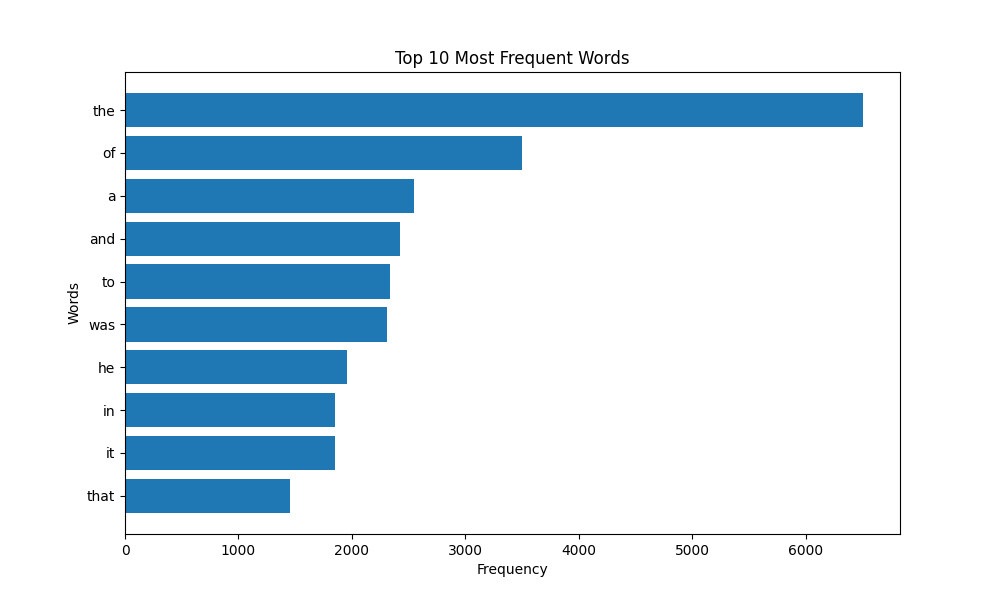

# Algo2. Home work 6
## "Parallel calculations basics and MapReduce model"

### Task

Write a Python script that downloads text from a given URL, analyzes the frequency of words in the text using MapReduce and visualizes the top words with the highest frequency in the text.

#### Step-by-step instructions
1. Import the necessary modules (`matplotlib` and others).
2. Get the code implementation of MapReduce from the lecture notes.
3. Create a function `visualize_top_words` for visualizing the results.
4. In the main block of code retrieve the text from the URL, apply MapReduce and visualize the results.

#### Solution

The task is done in file `top_words.py`.

